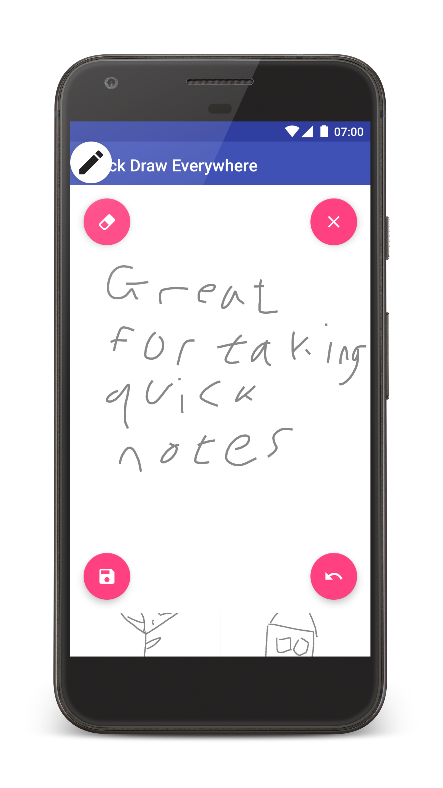

# Quick-Draw-Everywhere
Quickly draw anywhere on your screen

| Gallery screen | Drawing floating screen |
|:-:|:-:|
|  | 

## Licensing
QuickDrawEverywhere is licensed under the [GNU v3 Public License.](LICENSE)
